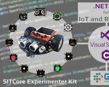
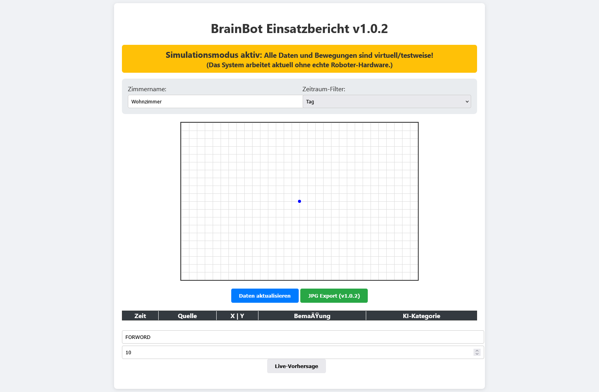

# 🤖 BrainBot Analyse & Bemaßung v1.0.2

<p align="left">
  
  
</p>

Willkommen beim BrainBot-Steuerungssystem!
Dieses Projekt ermöglicht die Fernsteuerung und Analyse eines Roboters über ein modernes Web-Dashboard, die Speicherung und Auswertung von Sensordaten, KI-gestützte Kategorisierung sowie den Export technischer Berichte.
**Das System läuft standardmäßig im Simulationsmodus** – auch ohne echte Hardware.

---

## 🚀 Features

- **Web-Dashboard:** Live-Visualisierung der Roboterposition auf einem 2D-Gitter, Tabellenansicht, Exportfunktionen.
- **Simulationsmodus:** Vollständige Funktionalität ohne Hardware – alle Bewegungen, Sensordaten und KI-Vorhersagen werden simuliert.
- **MSSQL-Integration:** Speicherung von Bewegungsdaten, Distanzen und Payloads in einer Microsoft SQL Server-Datenbank.
- **Technisches Zeichnen:** Automatisierte Erstellung von JPG-Exporten der Raummaße.
- **REST-API:** Steuerung, Status, Not-Aus, Export, KI-Vorhersage.
- **KI-Integration:** Live-Kategorisierung (z.B. „Flur“, „Hindernis“) per API und im Dashboard, ML.NET-ready.
- **Testautomatisierung:** Umfangreiche Unit- und Integrationstests für alle Kernfunktionen.
- **Logging:** Zentrales, thread-sicheres Logging aller Aktionen und Fehler.

---

## 🛠 Technologie-Stack

- **Backend:** .NET 10, ASP.NET Core Web API
- **Frontend:** HTML5, CSS3, JavaScript (Vanilla)
- **Datenbank:** Microsoft SQL Server (LocalDB oder Server)
- **KI:** ML.NET (vorbereitet, aktuell Simulationsmodus)
- **Bibliotheken:** Newtonsoft.Json, Microsoft.Data.SqlClient, System.Drawing.Common, Microsoft.ML (optional für KI)

---

## 📂 Projektstruktur

```
/Models                // Datenbank, Hardware, KI, Simulation, Logging
/Controllers           // API-Endpunkte (WebControlController)
/wwwroot/web_control   // Web-Frontend (index.html)
/wwwroot/exports       // Generierte JPG-Berichte
/Tests                 // Unit- und Integrationstests (xUnit)
README.md              // Diese Anleitung
```

---

## ⚙️ Installation & Setup

### Voraussetzungen

- **.NET 10 SDK** (https://dotnet.microsoft.com/download)
- **Visual Studio 2022/2026** (Community Edition reicht)
- **Microsoft SQL Server** (LocalDB oder Server, Standard-Instanz: `BrainBotAI`)
- **(Optional für KI)**: ML.NET NuGet-Paket (`Microsoft.ML`)

### Schritte

1. **Repository klonen:**
```sh
git clone https://github.com/marcus39-web/GHI-CSharp-Roboter-OOP.git
cd GHI-CSharp-Roboter-OOP
```

2. **Abhängigkeiten installieren:**
   - Öffne die Solution (`.sln`) in Visual Studio.
   - Stelle sicher, dass die NuGet-Pakete installiert sind (werden beim ersten Build automatisch geladen).

3. **Datenbank einrichten:**
   - Stelle sicher, dass ein SQL Server (LocalDB reicht) läuft.
   - Die Datenbank wird beim ersten Start automatisch angelegt und verwendet.

4. **Frontend vorbereiten:**
   - Stelle sicher, dass `index.html` auf „In Ausgabeverzeichnis kopieren: Immer kopieren“ steht.

---

## 🖥️ Benutzung

1. **Projekt starten:**
   - Drücke `F5` in Visual Studio oder führe `dotnet run` im Projektverzeichnis aus.

2. **Web-Dashboard öffnen:**
   - Im Browser: [http://localhost:5000](http://localhost:5000)

3. **Funktionen im Dashboard:**
   - **Live-Visualisierung:** Bewegungen und Positionen werden auf dem Gitter angezeigt.
   - **Tabellenansicht:** Alle Bewegungsdaten, Sensordaten und KI-Kategorien.
   - **JPG-Export:** Klick auf „JPG Export“ erzeugt eine technische Zeichnung.
   - **Live-KI-Vorhersage:** Eingabefelder für Kommando & Distanz, Button für Sofort-Vorhersage.
   - **Simulationsmodus-Hinweis:** Gelber Banner oben im Dashboard.

4. **API-Endpunkte (Auszug):**
   - `POST /api/webcontrol/connect` – Verbindung (Simulationsmodus)
   - `POST /api/webcontrol/command` – Befehl senden
   - `POST /api/webcontrol/predict` – KI-Vorhersage (Kommando, Distanz)
   - `POST /api/webcontrol/emergency-stop` – Not-Aus
   - `POST /api/export` – JPG-Export

---

## 🧪 Testen

1. **Alle Tests ausführen:**
   - Im Test-Explorer von Visual Studio: „Alle Tests ausführen“
   - Oder per Konsole:
```sh
 dotnet test
```

2. **Testabdeckung:**
   - Tests für Simulation, API, Logger, Map, Export, Datenbank, KI-Vorhersage.

---

## 🤖 KI-Integration (ML.NET-ready)

- Die KI-Vorhersage ist generisch vorbereitet (`PredictionService`).
- Im Simulationsmodus werden Zufallswerte geliefert.
- **Echtes ML.NET-Modell einbinden:**  
  - Installiere das NuGet-Paket `Microsoft.ML`.
  - Ersetze die Logik in `PredictionService` durch das Laden und Anwenden deines Modells.
  - Die API und das Frontend müssen nicht angepasst werden.

---

## ⚠️ Hinweise

- **Simulationsmodus:** Standardmäßig aktiv, alle Daten sind virtuell. Umschalten auf echten Betrieb durch Anpassung des Parameters `simulate` in `RobotGateway`.
- **Plattform:** JPG-Export nutzt System.Drawing und ist für Windows optimiert (Warnung CA1416 unterdrückt).
- **Datenbank:** LocalDB oder SQL Server erforderlich.

---

## 🛡️ Sicherheit & Erweiterung

- **Benutzerverwaltung:** Kann bei Bedarf mit ASP.NET Identity/JWT ergänzt werden.
- **Deployment:** Dockerfile und Azure-Deployment können einfach ergänzt werden.
- **Dokumentation:** API-Doku (Swagger/OpenAPI) kann mit wenigen Zeilen aktiviert werden.

---

## 👨‍💻 Entwicklerhinweise

- **Simulationsdaten:** Werden automatisch generiert und in `learning_data.jsonl` gespeichert.
- **KI-Modelle:** Trainingsdaten können mit Python, scikit-learn oder ML.NET erzeugt werden.
- **Erweiterung:** Neue Features (z.B. Heatmaps, Anomalieerkennung, Benutzerverwaltung) können modular ergänzt werden.

---

## 📧 Kontakt

**Autor:** Marcus Reiser  
**GitHub:** [marcus39-web](https://github.com/marcus39-web)  
**Lizenz:** MIT License – frei verwendbar für Bildungs- und Demonstrationszwecke

---

**Viel Erfolg beim Testen**

